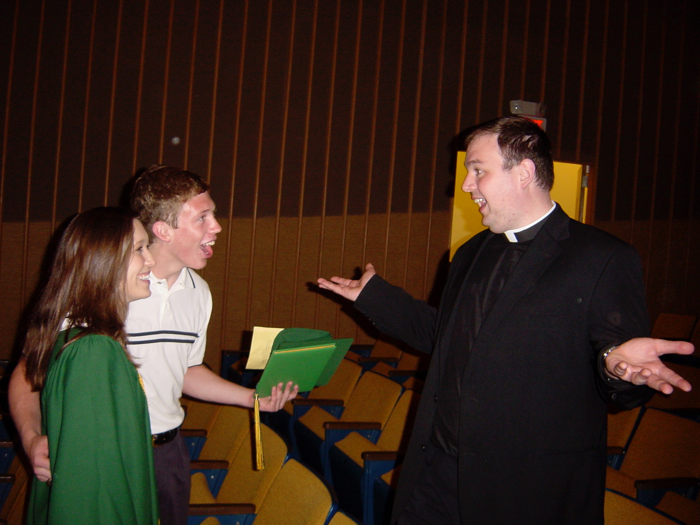

### TL;DR

The short answer that I'm cheap and my blog is really simple. Since I finished my Sabbatical, I haven't had any cause to use my blog except for the parish bulletin.

This much simpler and easier to use redesign is actually built in Gatsby on top of React and GraphQL. It's a fully implemented PWA with really great scores on all the audits, especially A11Y. 

